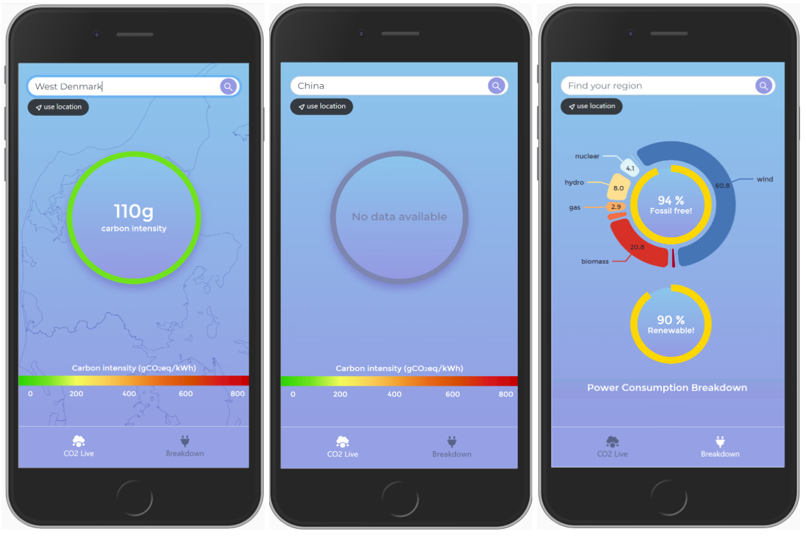
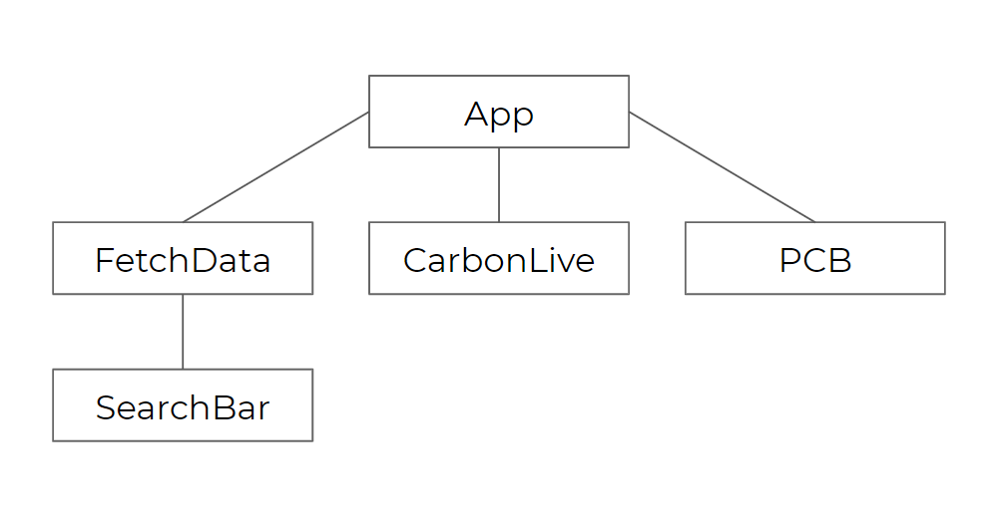

# Carbon Live

Carbon Live is a web application that enables people to know the amount of carbon emissions emitted from electricity of their own region. It keeps live track of the carbon intensity as well breaks down the power consumption into the energy sources in percentile groups and what percentage of the consumed energy sources are considered to be fossil free.

### Design Considerations
When starting the design of the app there were two major things to consider. One, the app is aimed for a non-technical audience. So the information that is being displayed needs to trigger some kind of understanding without having to be an expert about the subject. The app should be intuitive and easy to use. Second, since I did not have prior experience with React or other front-end development tools I needed to create a design that would not be too overcomplicated but still built it in such a way that it would be easy enough to add new features.

So how can we make an app that makes people understand if the electricity in their area is "clean" or not? Most people would probably consider clean electricity to be energy that is generated from sources that do not pollute and have a very low carbon footprint. So showing the number of consumed carbon would give people an idea of how clean their electricity currently is. However, showing just a number might seem vague to a lot of people. Therefore, I added a color and a gradient color bar to represent the scale of the colors. I also chose a universal color palette to represent whether the number is "good" or "bad": a green to red gradient.

The background currently shows the outline of Jutland. However, the idea (for potential future iteration) is that it will display the outline of the user's specific region. It gives a little bit more dimension and it creates a connection between the numbers and the region.

In terms of usability, I added a searchbar on top. The user can either click on the search icon or press enter to submit the query. However, to make it even easier to find their region I also added a "use location" button that will search for the information of the region the user is  currently  located in.
The data will be updated when a query has been made. It will show a "No data available" message when no data was found about this specific region. A future improvement could be to add suggestions, in case of misspelling, or add autocomplete.

Moreover, a simple bottom navigation bar was implented to easily switch between "CO2 Live" and "Breakdown".

### Architecture

The SearchBar component triggers a search event to the FetchData component. In here, Fetchdata receives the region and first looks for its corresponding ID through the API. Then retrieves the carbon intensity as well as the power consumption breakdown (PCB) data and sends it to the App component. Then App sends the carbon intensity data to the CarbonLive component and the PCB data to the PowerBreakdown component.

